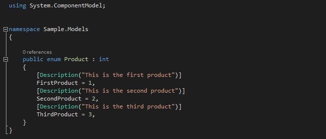
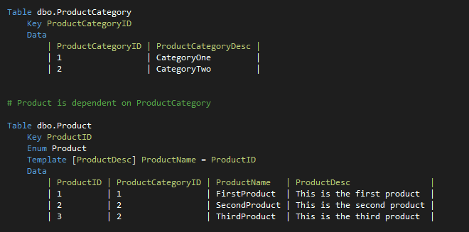

##Domain Values Extension

A Visual Studio extension for generating TSQL merge statements and optionally, enumerations from a template.

Intended to store domain values (or static data) for a database project.

*This project is still in development - more information will be added soon.*

**Features**

- Syntax Highlighting 
- Validation 
- Automatic formatting of tabular data
- Works with C# and VB project types
- Add multiple definitions to a file
- Options for handling nulls and spaces
- Composite database keys

**Examples**

The example above generates a new file with the content below.

If you also want to generate an enumeration add two extra lines to the template.

Which creates an additional file in either VB or C# depending on the project type.

Additional options allow you to change the access, set the base type and add a Flags attribute.

Keep related data together by adding more templates to the file.

