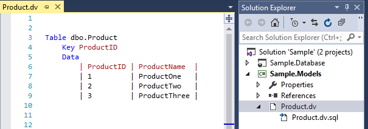
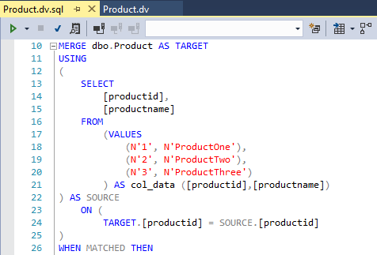
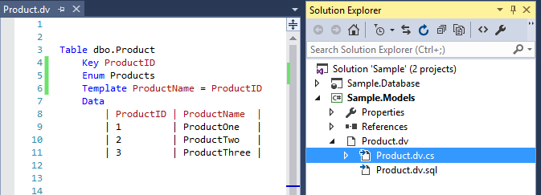
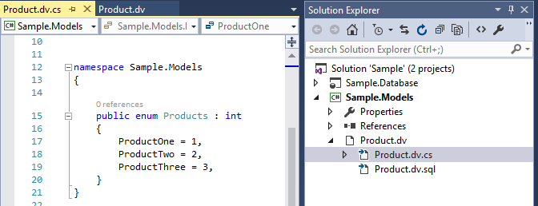
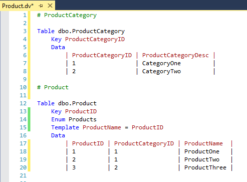

## Domain Values Extension

A Visual Studio extension for generating TSQL merge statements and optionally, enumerations from a template.

Intended to store domain values (or static data) for a database project.

Download the vsix from the [Visual Studio Gallery](https://visualstudiogallery.msdn.microsoft.com/41adddea-6410-4e5f-b36b-a8c31146d6ab?SRC=Home)

**Features**

- Syntax Highlighting 
- Validation 
- Automatic alignment of tabular data
- Works with C# and VB project types
- Add multiple definitions to a file
- Options for handling nulls and spaces
- Supports composite database keys

More information can be found on the [Wiki](https://github.com/dannyquinn/domainvalues/wiki)

**Examples**

The example above generates a new file with the content below.

If you also want to generate an enumeration add two extra lines to the template.

Creates an additional file in either VB or C# depending on the project type.

Keep related data together by adding more templates to the file.

