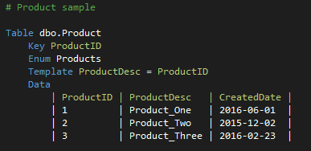

# domainvalues

A Visual Studio extension for generating sql merge statements and optionally, enumerations from a template.

Intended to store domain values (or static data) for a database project.

