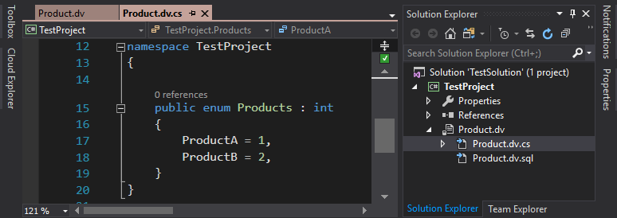

## Domain Values Extension for Visual Studio

[](https://ci.appveyor.com/project/dannyquinn/domainvalues)
[](LICENSE.txt)


Download this extension from the Marketplace. 

[Visual Studio 2017](https://marketplace.visualstudio.com/items?itemName=DannyQuinn.DomainValues2017)  
[Visual Studio 2019](https://marketplace.visualstudio.com/items?itemName=DannyQuinn.DomainValues)  
[Visual Studio 2022](https://marketplace.visualstudio.com/items?itemName=DannyQuinn.DomainValues2022)   

or get the [CI build](http://vsixgallery.com/author/danny%20quinn).

See the [change log](CHANGELOG.md) for changes and road map.

--------------------------------------------

An extension that makes synchronizing database lookup values and enumerations easier.

### Features

- Syntax Highlighting
- Validation
- Automatic alignment of tabular data
- Works with C# and Visual Basic project types
- Multiple definitions per file 
- Options for nulls and empty strings
- Supports single and composite database keys


### Prerequisites

- Visual Studio 2022 with extension development component

### Get the code

- Clone this repo: `git clone https://github.com/dannyquinn/domainvalues.git`
- Open solution and ensure that the project named DomainValues is the startup project.
- Open the project properties for DomainValues and select the debug tab.
- Set the start up program to devenv.exe (e.g. `C:\Program Files\Microsoft Visual Studio\2022\Community\Common7\IDE\devenv.exe`).
- Set the command line arguments to `/rootsuffix Exp`
- Save the project and press F5 or choose the menu command Debug > Start Debugging.
- An experimental instance of Visual Studio will launched with the extension loaded.

### Quick Start 

In Visual Studio, open a C# or Visual Basic project and open the *Add New Item* dialog.


In the *Data* section, select the **Domain values** item template, rename the file to Product.dv and then click Add.

A basic file is created from the template using the file name supplied.


In the above example, the file is intended to populate the dbo.Product table.  

After the Data keyword the column names are listed separated by the pipe character and each subsequent line represents one row of data.  As more lines or columns are added the table automatically formats to keep the columns aligned.

The ProductID column also appears next to the *Key* keyword and so will be used to determine if a row should be created, updated or deleted.

See [Basic Syntax](https://github.com/dannyquinn/domainvalues/wiki/Basic-Syntax) in the wiki for more information.

In the solution explorer, just under the newly created Product.dv file is a second file named Product.dv.sql.  This contains the sql statement generated from the contents of product.dv.  

*If the project type is Visual Basic, the file will not display automatically.  To see the file in a VB project click the show all files icon in the solution explorer.*

Every time the file is saved the sql file will be updated.  

To add an enum to the project using the same values, replace the text in Product.dv with the following...

```
Table dbo.Product
    Key ProductID 
    Enum Products 
    Template ProductName = ProductID 
    Data 
        | ProductID | ProductName |
        | 1         | ProductA    |
        | 2         | ProductB    |
```

When the file is saved another file will appear.  This contains the enumeration code and the language is determined by the project type.  


Open the Product.dv.cs file to view the enumeration.



The enum base type and access modifier can be changed, descriptions can be added to each member and the [Flags] attribute can be added.  

See [Enumerations](https://github.com/dannyquinn/domainvalues/wiki/Enumerations) in the wiki for more information.

#### Using the generated sql file with a database project

Add a database project and create a product table and a post deployment script as below.


Build the solution and then right click the database project and select publish.  

Add the connection info and click the publish button.

Once complete the data from the products.dv file will be in the product table.


To keep all the database assets in the database project, use the *Copy sql to* command in the Product.dv file.  

The file can be copied to any folder in the solution (the folder must already exist).  


The copied file will be updated anytime a change is made.

----------------------------------------

[See the wiki pages for more information](https://github.com/dannyquinn/domainvalues/wiki)
